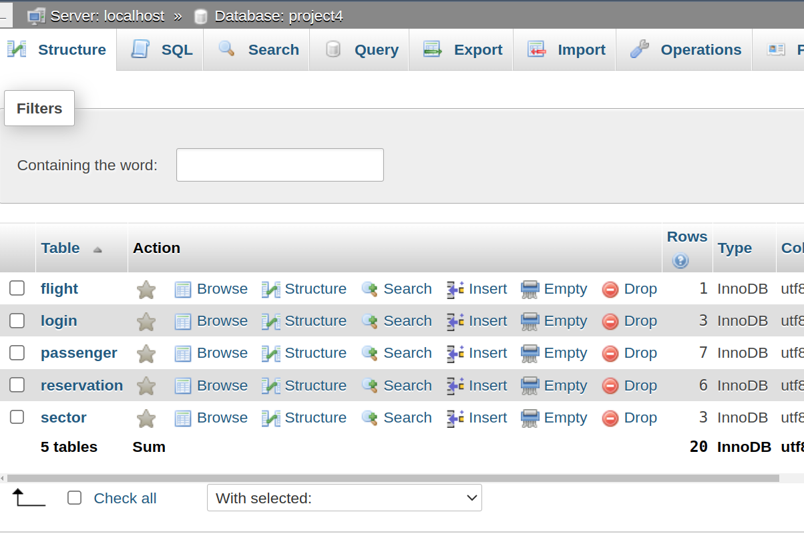
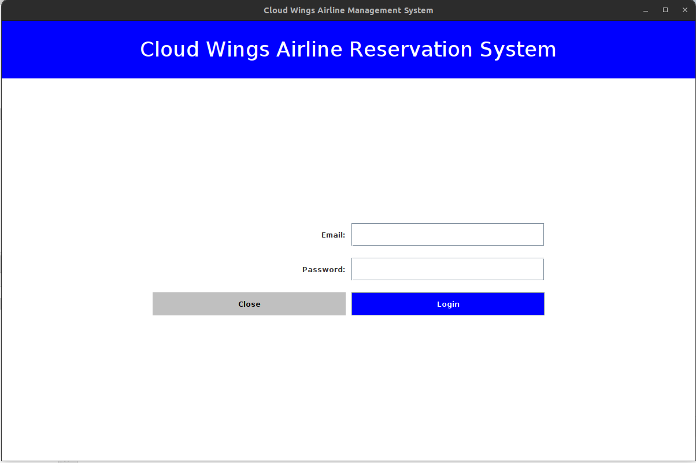
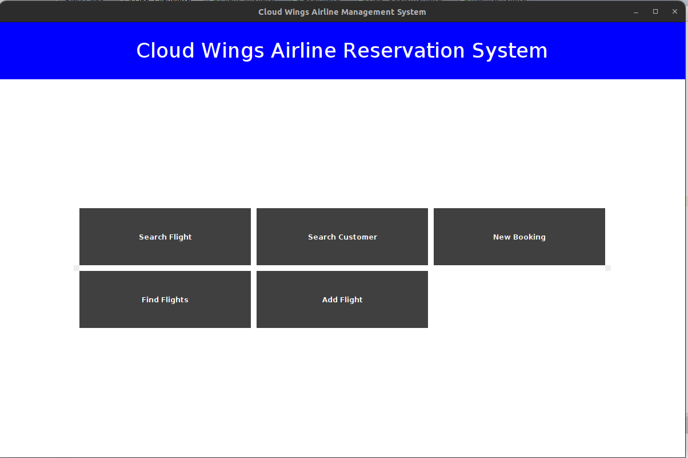
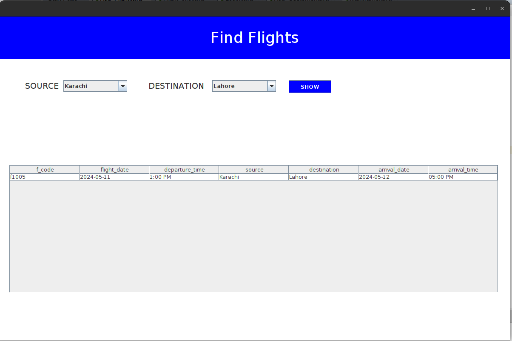
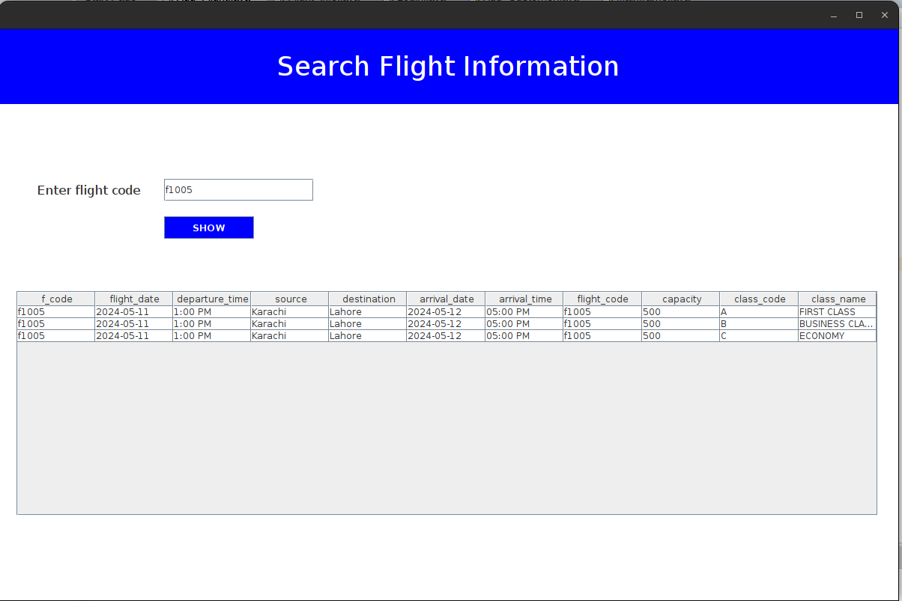
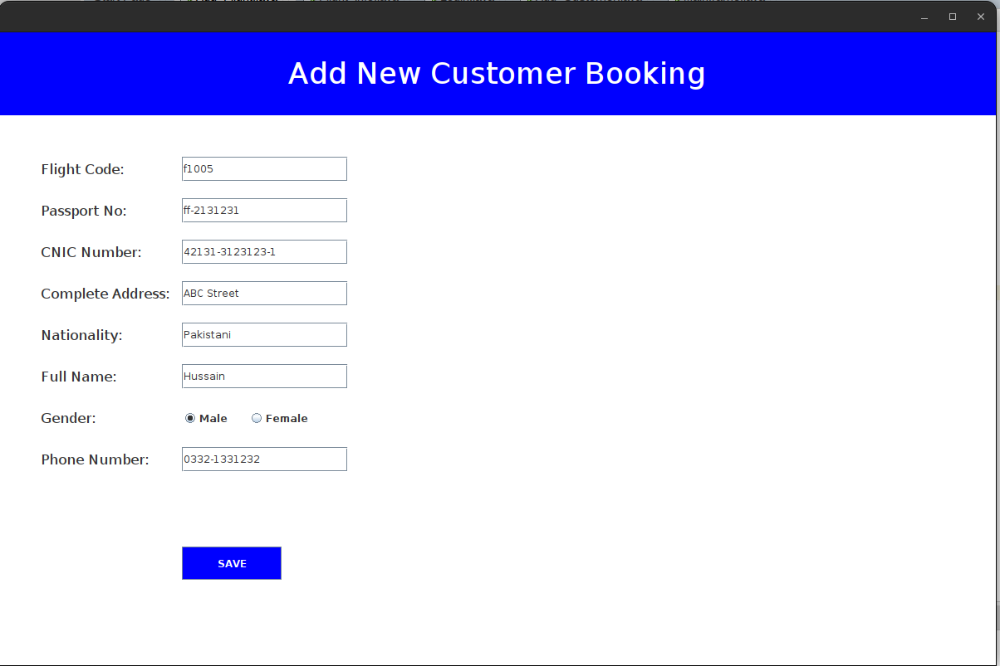

# Airline Management System

This is an open-source Airline Management System developed using Java and Swing. It allows users to manage flights, reservations, and other aspects of an airline's operation.

## Requirements

Before running this application, ensure that you have the following:

- Java Development Kit (JDK) installed on your system.
- XAMPP installed for managing MySQL and Apache servers.

## Installation

1. Clone the repository to your local machine

2. Start XAMPP and ensure that both MySQL and Apache servers are running.

3. Import the `project4.sql` file into your localhost/phpmyadmin database. This file contains the entire MySQL database schema for the project.

## Usage

1. Open the project in NetBeans or any other Java IDE.

2. Compile and run the `Login.java` file to start the application.

3. You will be presented with a login screen. Use appropriate credentials to log in as defined in database project4

4. Once logged in, you can navigate through various functionalities such as managing flights, reservations, etc.

## Screenshots

## License

This project is licensed under the [MIT License](LICENSE).

## Contributions

Contributions are welcome! Feel free to fork the repository and submit pull requests for any enhancements or bug fixes.
